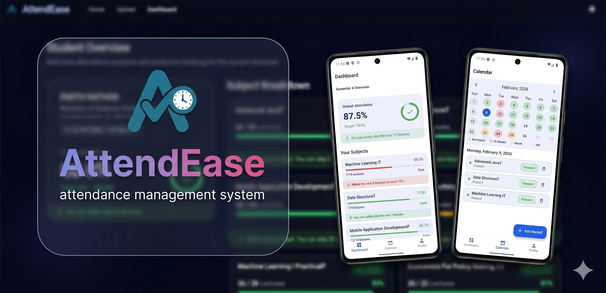
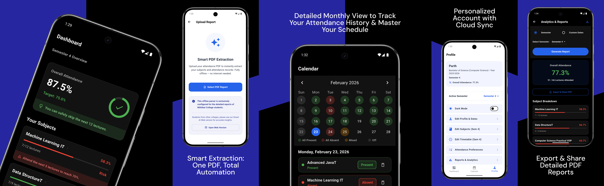

<div align="center">
  <h1>AttendEase</h1>
  <br /><br />
<a href="https://github.com/PaRth0566/AttendEase/releases/download/v1.0.3/AttendEase.apk"></a> &nbsp&nbsp&nbsp&nbsp
<a href="https://attendease-cbc6f.web.app"></a><br><br>
<a href="https://github.com/neo999in/AttendEase-backend"></a><br>
</div>

---
### 📖 Description




**AttendEase** is an attendance management system designed to streamline how students track and analyze their academic presence. By leveraging the power of Google's Gemini, Attend Ease automates the tedious task of manual entry by extracting structured data directly from PDF attendance reports. It provides a premium, intuitive dashboard that offers deep insights, trend analysis, and predictive metrics to help users stay ahead of their attendance requirements.

> [!IMPORTANT]
> **Disclaimer**: AttendEase is an automated tool. We are not liable for any calculation inaccuracies or resulting consequences. Please verify your attendance with official college records.
>
> **Privacy Note**: AttendEase handles sensitive PDF data securely. The Node.js backend acts as a secure bridge, ensuring your AI processing remains private.


---

### 📸 Screenshots
<div align="center">
  
</div>
  
---

### ✨ Features
- 🤖 **AI-Powered PDF Ingestion**: Seamlessly extract attendance records from PDF documents using Gemini multimodal capabilities.
- 📄 **Local PDF Parser**: High-performance client-side PDF parsing to extract attendance data locally for rapid processing and offline support.
- 📊 **Intelligent Insights**: Dynamic analysis of attendance patterns with AI-driven predictions and actionable summaries.
- 📅 **Smart Calendar**: Integrated dashboard to visualize historical attendance and manage daily schedules efficiently.
- 🔔 **Target Monitoring**: Set attendance goals and receive smart notifications to ensure you never fall below required thresholds.
- 📱 **Cross-Platform Sync**: Truly unified experience across Android and Web with real-time Firebase Cloud Firestore synchronization.
- 🔐 **Secure Backend**: Dedicated Node.js proxy to handle AI requests safely, keeping your environment keys protected.
- 🎨 **Premium UI/UX**: A modern, card-based interface and dynamic progress indicators.

---

### 🛠 Requirements
Before you begin, ensure you have met the following requirements:
* **Flutter SDK**: `^3.10.7` or higher.
* **Dart SDK**: Compatible with the Flutter version.
* **Node.js**: `v16.0.0` or higher (for backend services).
* **IDE**: [Android Studio](https://developer.android.com/studio) or [VS Code](https://code.visualstudio.com/) with Flutter/Dart plugins.
* **Platform**: 
    - **Android**: SDK 21 (Android 5.0) or higher.
    - **Web**: Modern browser with JavaScript enabled.

---

### 🛠 Tech Stack
<a href="https://flutter.dev/"></a>
<a href="https://dart.dev/"></a>
<a href="https://ai.google.dev/"></a>  
<a href="https://firebase.google.com/"></a>
<a href="https://nodejs.org/"></a>
<a href="https://www.sqlite.org/"></a>
<a href="https://render.com/"></a>

- **Key Packages**:
  - `syncfusion_flutter_pdf` (PDF Processing)
  - `table_calendar` (Calendar Integration)
  - `firebase_auth` & `google_sign_in` (Authentication)
  - `sqflite` (Local Persistence)
  - `flutter_local_notifications` (Push Notifications)

---

### 📂 Folder Structure
```text
AttendEase/
├── lib/               # Core Flutter application source files
│   ├── screens/       # Feature-specific UI components
│   ├── database/      # SQLite & Local DB management
│   ├── services/      # Firebase & API integration logic
│   └── router/        # GoRouter navigation configuration
├── backend/           # Node.js Express server for Gemini AI
└── assets/            # App icons, images, and static resources
```
---
### 📄 License

Released under the <a href="./LICENSE"></a>
